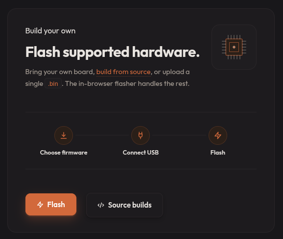
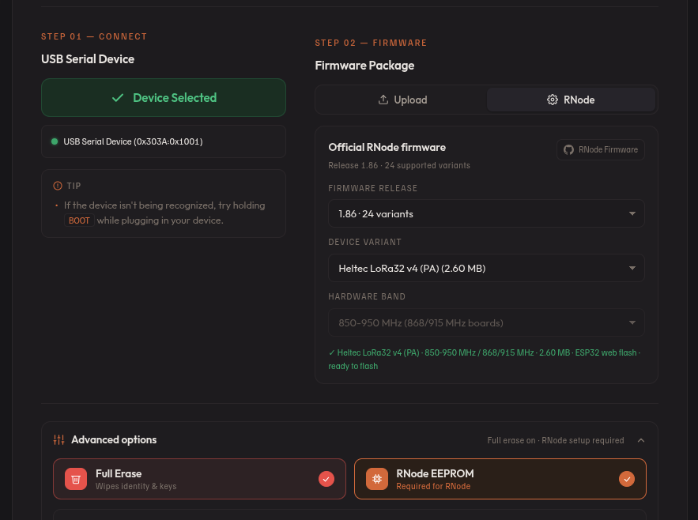
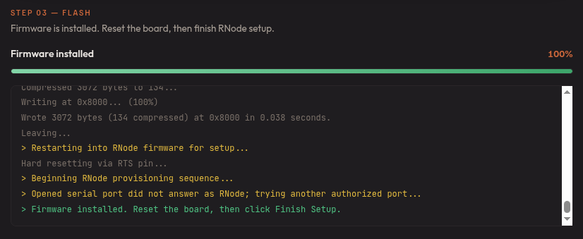
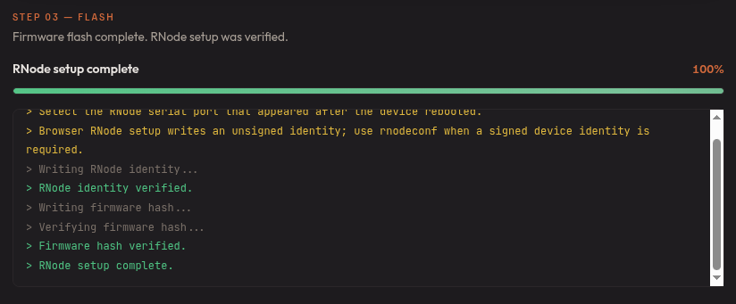

# Flashing the Heltec LoRa32

This section provides step-by-step instructions for flashing the [Heltec LoRa32 device](https://heltec.org/product-category/lora/lrnode/esp32-lora/) with Ratspeak using the web-based installer.

This guide assumes you're using the V4 device; however, the general instructions also apply to earlier versions.

## Preparation

To begin, you'll need:

- Heltec LoRa32 device
- USB-C data transfer cable
- A computer with a supported browser (see below)

To use the web flasher, your browser must support the Web Serial API (Chrome, Edge, Opera, or Firefox 151+) so it can detect and connect to the board.

:::warning
If this is the first time using the Heltec LoRa32, ensure that the antenna is attached before powering it on, as using the device without it can damage the radio receiver.
:::

## Getting started

1. Navigate over to the [Ratspeak download page](https://ratspeak.org/download.html).

2. Scroll down to the **Build your own** section and select **Flash**.

## Connecting the Heltec LoRa32

1. With the USB-C port facing you, hold down the **left** button on the LoRa32 and plug it into the computer via a data transfer capable USB-C cable.

2. You should see an orange light flash briefly. Note that the screen will remain off, but the device will now be detectable by your computer.

## Flashing

1. On the download page, click **Select USB Device**. A menu will appear prompting you to select the proper device. Select the Heltec LoRa32; depending on the system hardware, it may appear under various names.

2. On the right, select **RNode**. Three dropdown menus will appear. In the second dropdown titled **Device variant**, select the Heltec LoRa32 version that corresponds with your device.

3. It is recommended to also turn on **full erase** under advanced options.

4. Click **Flash**. The installation process will now commence.

5. A successful flash will produce the below output:

6. Press the **right** button on the device to reboot it. When the screen returns, click **Finish flashing** in the browser.

7. After the device has finished flashing successfully, the following output will be shown, and you can safely disconnect the device:

:::tip[Congratulations, you're now a Ratspeak user!]
Questions? Reach out in the **#documentation** channel on our [Discord](https://ratspeak.org/discord).
:::
