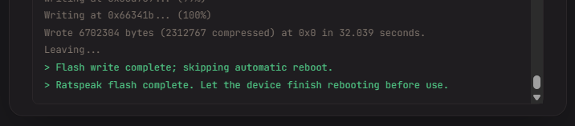

# Flashing the T-Deck Plus

This section provides step-by-step instructions for flashing the [LilyGO T-Deck Plus](https://lilygo.cc/en-ca/products/t-deck-plus-1) with Ratspeak using the web-based installer.

For the unified firmware, check that the selected release is **Ratspeak Handheld**.
If the board preset still shows rsDeck, upload `rsdeck-full.zip` from the
[unified releases](https://github.com/ratspeak/ratspeak-handheld/releases) through
**Build your own** instead. See the [package guide](/docs/hardware/flashing-firmware)
for the distinction between fresh installs and updates.

## Preparation

In order to begin, you will need:

- LilyGO T-Deck Plus device
- USB-C data transfer cable
- A computer with an appropriate browser

Use a desktop browser with Web Serial support, such as Chrome or Edge, to connect
to the board.

Back up internal flash and the SD card before flashing; see the
[backup instructions](/docs/hardware/flashing-firmware#before-flashing).
Full packages are fresh-install images, not data-preserving updates.
Leaving **Full Erase** off does not prevent
a factory image from overwriting saved data.

:::warning
Attach the antenna before powering on the T-Deck Plus. Transmitting without it can damage the radio.
:::

## Getting started

1. Navigate over to the [Ratspeak download page](https://ratspeak.org/download.html).

2. Select the T-Deck Plus from the available hardware options presented and select 'Flash in browser'.

## Connecting the T-Deck Plus

1. With your T-Deck Plus' main power switched off, connect it to your computer via a data transfer capable USB-C cable.

2. Press on the trackball until you hear a click, and hold it.

3. Turn on the main power of your device while continuing to hold the trackball for three seconds, then release the trackball. Note that the screen will be black, as it has been booted in 'download mode'; it will still be detectable by your computer.

## Flashing

1. On the T-Deck Plus download page, click '**Select USB Device**'. A menu will appear prompting you to select the proper device. Pair the T-Deck Plus; depending on the system hardware, it may have a variety of names.

2. For a fresh installation, choose **Full** to include the launcher and both
   modes. After verifying your backup, enable **Full Erase** to clear internal storage.

3. Click **Flash**, check the device and backup notice, then continue.

4. A successful flash will produce the below output:

5. Simply reboot your device using the button on the left side of the T-Deck Plus. Ratspeak should boot up in a few seconds.

:::tip[Congratulations, you're now a Ratspeak user!]
Questions? Reach out in the **#documentation** channel on our [Discord](https://ratspeak.org/discord).
:::
